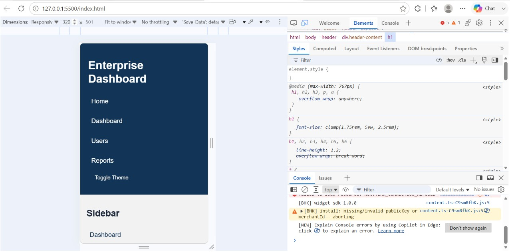
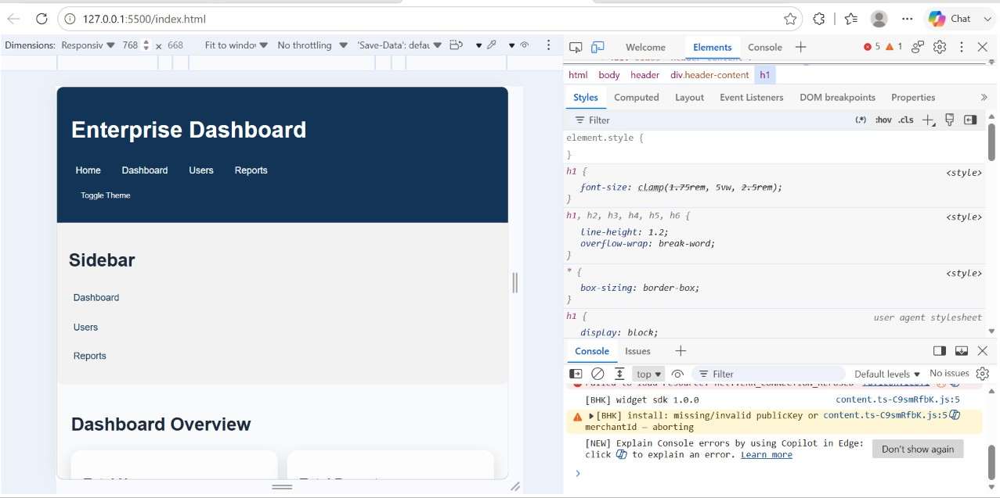
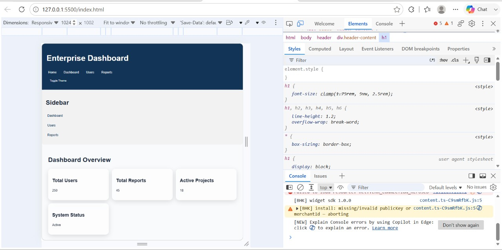
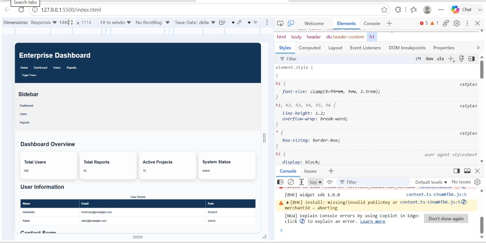

# Semantic HTML5 & Accessible Component Architecture

## Overview

This project is an accessible enterprise dashboard built using semantic HTML5 and modern responsive CSS architecture.

The project focuses on accessibility, responsive design, reusable design tokens, CSS Grid, Flexbox, glassmorphism effects, and dark/light theme support.

## Features

- Semantic HTML5 structure
- Accessible navigation and form elements
- Responsive mobile-first design
- CSS custom properties (design tokens)
- Responsive CSS Grid
- Flexbox layout
- Glassmorphism effects
- Soft shadows and hover transitions
- Dark and light theme variables
- Responsive tables
- Mobile horizontal overflow prevention
- Accessible dialog component
- Responsive design testing at multiple breakpoints

## Responsive Design

The dashboard uses a mobile-first CSS architecture with the following breakpoints:

| Breakpoint | Device |
|------------|--------|
| 320px | Mobile |
| 768px | Tablet |
| 1024px | Desktop |
| 1440px | Large Desktop |

## Design Tokens

The CSS uses custom properties for consistent design:

- Brand colors
- Background colors
- Text colors
- Border colors
- Status colors
- Typography scale
- Spacing scale
- Border radius
- Shadows
- Transitions

## Layout

CSS Grid is used for the dashboard cards.

- Mobile: 1 column
- Tablet: 2 columns
- Desktop: 3 columns
- Large desktop: 4 columns

Flexbox is used for navigation and flexible row layouts.

## Glassmorphism

The dashboard cards use a subtle glassmorphism effect with:

- Transparent backgrounds
- Backdrop blur
- Soft borders
- Soft shadows

## Dark / Light Theme

The project includes CSS variables for both light and dark themes.

The theme can be changed using the **Toggle Theme** button.

## Responsive Demo Screenshots

### 320px - Mobile



### 768px - Tablet



### 1024px - Desktop



### 1440px - Large Desktop



## Project Structure

```text
semantic-html5-accessible-dashboard-main/
│
├── index.html
├── css/
│   └── style.css
├── js/
├── pages/
├── docs/
├── screenshots/
│   ├── responsive-320px.png
│   ├── responsive-768px.png
│   ├── responsive-1024px.png
│   └── responsive-1440px.png
│
└── README.md